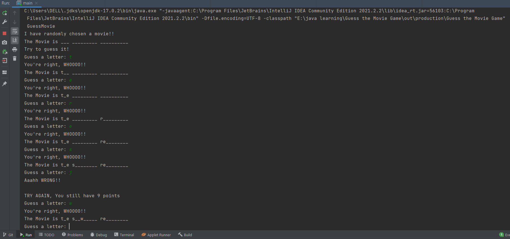

# GuessTheMovieGame
-A simple program in Java using OOP concepts for a game where the player gets to guess the movie name given the number of letters in it (pretty much like hangman but with movies)!
 
 

